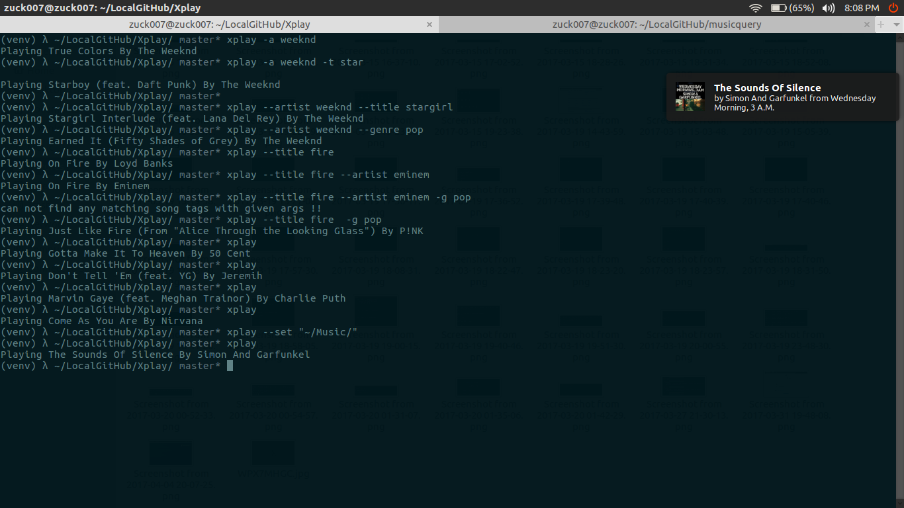

# xplay

> Play songs from CLI

[](https://raw.githubusercontent.com/zuck007/xplay/master/LICENSE) 
[](https://badge.fury.io/py/xplay)

## Installation
```
pip install xplay
```
## Usage
```
$ xplay -h
usage: xplay [-h] [-s SET] [-g GENRE [GENRE ...]] [-a ARTIST [ARTIST ...]]
             [-t TITLE [TITLE ...]]

Play any song from terminal

optional arguments:
  -h, --help            show this help message and exit
  -s SET, --set SET     set music_dir folder, default is ~/Music/
  -g GENRE [GENRE ...], --genre GENRE [GENRE ...]
                        play song of the given genre
  -a ARTIST [ARTIST ...], --artist ARTIST [ARTIST ...]
                        play song of the given artist
  -t TITLE [TITLE ...], --title TITLE [TITLE ...]
                        play song of the given title
```
## Demo

## Related
  * [musicquery](https://github.com/zuck007/musicquery) package